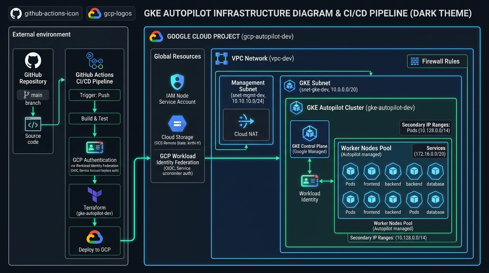

# GKE Autopilot Infrastructure Platform (Terraform & GitHub Actions)

[](https://github.com/kirthi0071/Terraform-GKE-Autopilot/actions/workflows/terraform.yml)

A production-grade, highly scalable Google Kubernetes Engine (GKE) Autopilot platform provisioned using **Terraform** and deployed via an automated, keyless **GitHub Actions CI/CD Pipeline** using **Workload Identity Federation (WIF)**.

---

## Architecture Diagram



---

## Repository Structure

```
.
├── .github/
│   └── workflows/
│       └── terraform.yml               # Automated CI/CD Pipeline (Plan on PR, Apply on Merge/Dispatch)
│
├── docs/
│   └── architecture.png                # Architecture Diagram
│
└── gke-platform/
    ├── modules/                        # Shared child modules (Re-usable, state-less)
    │   ├── network/                    # Wraps GCP VPC, subnets & firewall rules
    │   ├── iam/                        # Creates GKE Node SA & configures IAM bindings
    │   └── gke/                        # Wraps GKE Autopilot cluster module
    │
    ├── vpc/                            # ROOT MODULE 1 — Networking (VPC & Subnets)
    │   ├── backend.tf / backend-dev.hcl
    │   ├── main.tf / dev.tfvars / outputs.tf / variables.tf / providers.tf
    │
    ├── iam/                            # ROOT MODULE 2 — Identity & Access Management
    │   ├── backend.tf / backend-dev.hcl
    │   ├── main.tf / dev.tfvars / outputs.tf / variables.tf / providers.tf
    │
    └── gke/                            # ROOT MODULE 3 — GKE Autopilot Cluster
        ├── backend.tf / backend-dev.hcl
        ├── main.tf                     # Reads vpc & iam outputs via terraform_remote_state
        ├── dev.tfvars / outputs.tf / variables.tf / providers.tf
```

---

## Key Features & Architecture Highlights

1. **Modular & Decoupled Root Modules (`vpc/`, `iam/`, `gke/`)**
   - Separate lifecycle and state files prevent accidental destruction of networking or security resources during Kubernetes cluster updates.
   - Reduced blast radius: A broken apply in `gke/` cannot touch VPC or IAM configurations.

2. **Keyless GCP Authentication via Workload Identity Federation (WIF)**
   - No long-lived service account JSON keys stored in GitHub Secrets.
   - Uses short-lived OIDC tokens generated dynamically per workflow run.

3. **PR-Driven Infrastructure Workflow with Automated Gates**
   - Opening a Pull Request runs `terraform plan` for changed root modules and comments the plan diff directly on the PR.
   - Merging the PR to `main` automatically triggers sequential deployment: `vpc/` and `iam/` apply concurrently, followed by `gke/`.

---

## Prerequisites & Remote State Setup

### GCS Remote State Bucket

Before running `terraform init` for the first time, create the GCS bucket (`kirthi-tf`) for remote state storage:

```bash
gcloud storage buckets create gs://kirthi-tf --project=testing-project-499604 --location=asia-south1
gcloud storage buckets update gs://kirthi-tf --versioning
```

### GitHub Repository Secrets

Configure the following secrets in your GitHub Repository (**Settings > Secrets and variables > Actions**):

| Secret Name | Description |
|---|---|
| `WIF_PROVIDER` | Full resource name of your GCP Workload Identity Provider |
| `WIF_SERVICE_ACCOUNT` | Email of your GCP Service Account used by GitHub Actions |

---

## CI/CD Pipeline Workflow (`.github/workflows/terraform.yml`)

### **Pull Request Workflow (Review & Approval Gate)**
1. Create a feature branch, update any Terraform code, and open a Pull Request against `main`.
2. The `terraform.yml` pipeline automatically detects affected root modules (`vpc`, `iam`, or `gke`).
3. Runs `terraform plan` for each changed component in parallel.
4. Posts the detailed execution plan as a comment on your PR for team review and approval.

### **Merge Workflow (Automated Apply)**
1. Once the PR is approved and merged into `main`:
2. `terraform-apply-vpc` and `terraform-apply-iam` run concurrently.
3. `terraform-apply-gke` runs **last** to ensure it reads updated state from VPC and IAM.

### **Manual Dispatch Workflow**
You can also trigger a manual plan or apply directly from the GitHub Actions UI:
1. Navigate to **Actions > Terraform Pipeline > Run workflow**.
2. Select target component (`all`, `vpc`, `iam`, or `gke`) and action (`plan` or `apply`).

---

## Local Execution Guide

If you need to run Terraform locally from your workstation:

```bash
# 1. VPC Module (No dependencies)
cd gke-platform/vpc
terraform init -backend-config=backend-dev.hcl
terraform apply -var-file=dev.tfvars

# 2. IAM Module (No dependencies, parallel with VPC)
cd ../iam
terraform init -backend-config=backend-dev.hcl
terraform apply -var-file=dev.tfvars

# 3. GKE Module (Reads VPC and IAM state via terraform_remote_state)
cd ../gke
terraform init -backend-config=backend-dev.hcl
terraform apply -var-file=dev.tfvars
```

---

## Adding Environments (e.g. `staging`, `prod`)

To introduce additional environments without duplicating code structure:
1. Add environment-specific var files (e.g. `staging.tfvars`, `prod.tfvars`) under each root module directory.
2. Add corresponding backend configs (e.g. `backend-staging.hcl` with `prefix = "gke-platform/staging/vpc"`).
3. Execute `terraform init -backend-config=backend-staging.hcl` and `terraform apply -var-file=staging.tfvars`.
